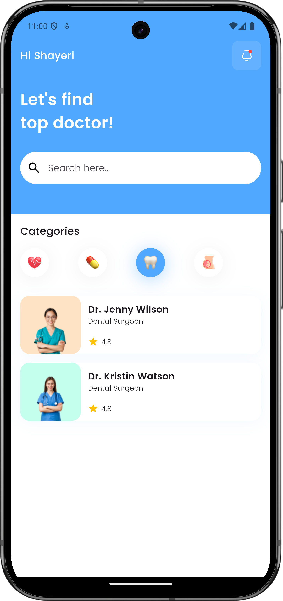
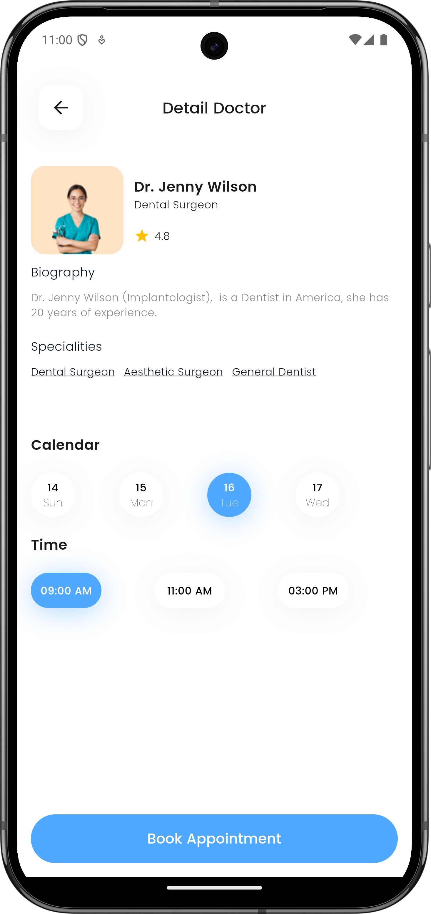

# DocSeek

**DocSeek** is a basic-level Flutter application that helps users find doctors and view their available appointment times.

## Features

- **Home Screen:** Displays categories of doctors for easy navigation.
- **Doctor Details Screen:** Shows detailed information about a selected doctor, including available dates and times for appointments.

## Screenshots

### Home Screen

### Doctor Details Screen



## Installation

To run this project locally, follow these steps:

1. Clone the repository:
    ```bash
    git clone https://github.com/yourusername/docseek.git
    ```
2. Navigate to the project directory:
    ```bash
    cd docseek
    ```
3. Install dependencies:
    ```bash
    flutter pub get
    ```
4. Run the app:
    ```bash
    flutter run
    ```

## Technologies

- **Flutter**: UI toolkit for building natively compiled applications for mobile.
- **Dart**: The programming language used to develop the app.

## Contribution

Contributions are welcome! Please open an issue or submit a pull request if you'd like to help improve the project.

## License

This project is licensed under the MIT License - see the [LICENSE](LICENSE) file for details.
